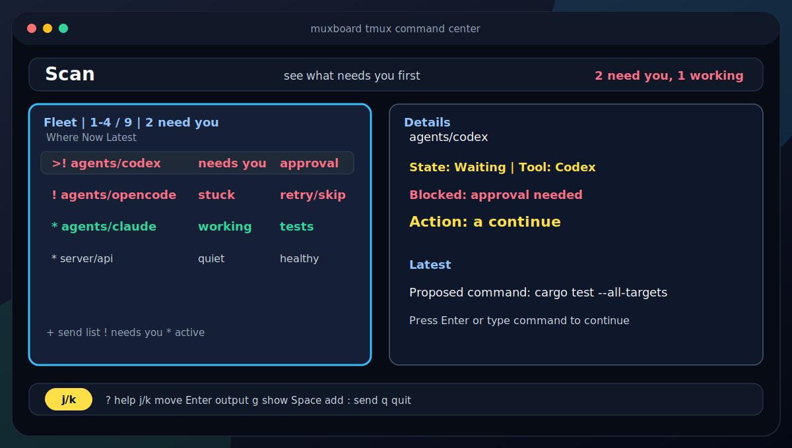

# muxboard

[](https://github.com/aanari/muxboard/actions/workflows/ci.yml)
[](https://github.com/aanari/muxboard/releases)
[](LICENSE-APACHE)
[](rust-toolchain.toml)

A tmux command center for AI agents, panes, and long-running terminal work.

`muxboard` is the calm "what needs me?" layer above your tmux sessions: scan the fleet, see which agents are stuck, jump to the right pane, reply, broadcast, or keep watching.



## Why muxboard?

- See every tmux pane and agent in one scan-friendly board.
- Know which Codex, Claude Code, Opencode, or shell job needs attention.
- Jump, reply, broadcast, save fleets, and recover without losing tmux context.

Muxboard is local-first and tmux-native. It runs where tmux runs, so the same workflow works locally, over SSH, and on servers.

## Install

You need `tmux` on the machine where you run `muxboard`.

```bash
cargo install --git https://github.com/aanari/muxboard --locked
muxboard
```

Download release binaries for Linux and macOS from the [latest release](https://github.com/aanari/muxboard/releases/latest).

For local development:

```bash
cargo install --path . --locked
cargo run
```

## tmux plugin

Muxboard ships a TPM-compatible tmux plugin in this repo. Install the binary first, then add:

```tmux
set -g @plugin 'aanari/muxboard'
```

Default key: `prefix` + `M`.

Useful presets:

- popup command center: quick overlay, leaves tmux layout untouched,
- dock: real tmux sidebar pane, best for long control sessions,
- drawer: temporary right-side overlay, closes cleanly after a jump,
- window: persistent control room.

See [`docs/tmux-plugin.md`](docs/tmux-plugin.md) for plugin settings, dock/drawer behavior, status widgets, and local-development options.

## What you see first:

- Fleet: every pane, agent, and long-running job in one scan-friendly list.
- Details: the selected pane's state, blocker, action, and useful output.
- Output: a deeper, scrollable view when you ask for more.
- Footer: the next safe keys, always visible.

Power stays one layer down until you need it:

- send lists, named fleets, lane sends, and review-before-send broadcasts,
- tmux-native agent starts in the selected pane's directory,
- Browse for sessions and windows, Command Center for fleet triage,
- attention sorting, search, filters, muted alerts, desktop alerts, and terminal bell alerts,
- recent commands, macros, pane CPU/memory, and XDG-persisted state.

## Quick start

The default path is intentionally small:

- `j` / `k` to move,
- `Enter` to show the selected pane output while staying in muxboard,
- `Esc` to back out of Output, Send, Browse, Command Center, or focused Details,
- `g` to show the selected pane in tmux while leaving muxboard running,
- `Space` to add or remove panes from the send list,
- `:` to type a command for the current send list,
- `a` to continue a waiting pane when muxboard offers that action,
- `s` to ask panes for one-line summaries,
- `x` to clear the send list,
- `/` to search,
- `q` to quit.

Send rules:

- nothing in the send list -> selected pane,
- one or more panes in the send list -> send list,
- review multi-target sends require `Enter` to confirm and `Esc` to cancel.

Need more? Press `.`. More keeps advanced actions in context: Browse, Command Center, start agent, fleets, lane send, pane CPU/memory, alerts, filters, notifications, and pane sends.

Secondary keys:

- `Tab` switches focus between Fleet and Details when both surfaces are active,
- `L` cycles layout: auto, side by side, stacked,
- `r` refreshes,
- on the Send surface, `]` repeats the most recent command to the current send destination,
- on the Send surface, `p` then a macro key pins the most recent command into a macro slot, default `1`-`5`,
- on the Send surface, a macro key replays a saved macro slot, default `1`-`5`,
- `Esc` backs out of active inputs and overlays.

Common More-menu keys, after pressing `.`. Labels adapt to the current surface:

- `Enter` shows output, returns to details, or opens a Browse window,
- `[` browses tmux sessions and windows,
- `]` shows Command Center,
- `c` mute selected alert,
- `w` unmute selected alert,
- `a` mute all alerts,
- `u` unmute all alerts,
- `i` continue waiting panes,
- `e` send `Enter` to the selected pane,
- `y` send `y` + `Enter`,
- `n` send `n` + `Enter`,
- `z` zoom the selected pane,
- `+` start a new agent in the selected pane's directory,
- `t` change sort order,
- `f` change visible panes,
- `g` save a fleet,
- `l` choose a saved fleet,
- `d` delete the selected saved fleet,
- `b` send to the selected lane,
- `m` toggle pane CPU/memory,
- `o` toggle desktop notifications,
- `v` toggle terminal bell,
- `h` cycle alert repeat delay,
- `p` cycle alert types.

Commands and macros support placeholders:

- `{session}`
- `{window}`
- `{path}`
- `{id}`
- `{cmd}`
- `{title}`
- `{lane}`

## SSH and local behavior

Desktop notification behavior:

- local GUI session: desktop notification plus terminal bell,
- SSH session: terminal bell and in-dashboard alerts only, no GUI notification attempts.

Terminal behavior:

- UTF-8 terminals get the normal clean bordered UI,
- `TERM=dumb`, non-UTF-8 locales, or `NO_COLOR` fall back to ASCII borders and plain styling.

Pane CPU/memory is host-local. It shows CPU and memory for each tmux pane PID on the host where `muxboard` is running. If a pane is an `ssh` client into another machine, the values reflect that local `ssh` process, not the remote workload behind it.

Structured fleet reports are host-agnostic. If an agent replies with `STATUS=... | BLOCKER=... | NEXT=...`, or emits a heartbeat like `muxboard: status=...; blocker=...; next=...`, muxboard will parse and surface that state in Fleet and Details.

Muxboard also reads conservative local status hints from recent Codex and Claude Code transcripts when they map cleanly to an obvious matching tmux pane. It uses that native signal for state, thread title, and review attention, while explicit tmux bridge hooks still take priority.

## Product scope

V1 is intentionally tmux-first and agent-control-first. It does not inspect repos, branches, or worktrees; fleet control works the same for local panes, SSH panes, and generic long-running terminal jobs. VCS context belongs in V2 as an optional project layer, not as a dependency for the core dashboard.

## Config and state

Muxboard uses XDG-style paths by default:

- config: `~/.config/muxboard/config.json`
- state: `~/.local/state/muxboard/state.json`

`XDG_CONFIG_HOME` and `XDG_STATE_HOME` are honored when set. Notification settings live in config, while muted alerts, recent commands, and macro slots live in state.

On first run, muxboard opens a small theme picker if no theme is configured. System Colors is highlighted by default so muxboard follows your terminal palette. Use `muxboard --theme-picker` to reopen it later, or script a dotfile choice with:

```bash
muxboard --theme system
```

Create a full editable config from the generated defaults:

```bash
config_dir="${XDG_CONFIG_HOME:-$HOME/.config}/muxboard"
mkdir -p "$config_dir"
muxboard --print-config-example > "$config_dir/config.json"
```

Useful config fields:

- `layout_preset` supports `Auto`, `Horizontal`, and `Vertical`.
- `ui_settings.theme.preset` supports `Calm`, `Contrast`, `Mono`, `TerminalNative`, `CatppuccinLatte`, `CatppuccinMocha`, `TokyoNight`, `GruvboxDark`, `GruvboxLight`, `Nord`, and `RosePine`.
- Kebab-case aliases like `light`, `dark`, `system`, `system-colors`, `catppuccin-mocha`, `tokyo-night`, `gruvbox`, `rose-pine`, `terminal`, `ansi`, and `no-color` also work.
- Named themes are semantic mappings into muxboard's slots; use System Colors, stored as `TerminalNative`, to follow your terminal palette, including WezTerm, Alacritty, iTerm, and tmux themes.
- Muxboard does not read terminal config files directly.
- The older `theme_preset` field still works for existing configs.

For a small custom touch, set `ui_settings.theme.overrides`, for example `"accent": "#4078F2"`, `"warning": "#fc0"`, or `"surface": "24"`. You can also copy `config.example.json` from the repo into your XDG config path.

To print ready-to-copy defaults:

```bash
muxboard --print-config-example
muxboard --print-default-keybindings
```

## Development

```bash
just guards
just contracts
just test
just test-live
just dogfood
just perf
just tmux-plugin-check
just lint
just ci
just ci-full
just release-check
```

Contributor workflow lives in [`CONTRIBUTING.md`](CONTRIBUTING.md).
Provider drift handling lives in [`docs/provider-drift.md`](docs/provider-drift.md).
The current test coverage map lives in [`docs/testing-matrix.md`](docs/testing-matrix.md).
The release checklist lives in [`docs/release.md`](docs/release.md).
Release notes live in [`CHANGELOG.md`](CHANGELOG.md).

## Probe dump

```bash
cargo run -- --dump-probe-json
```

Print the current tmux probe as JSON and exit.

## License

Licensed under Apache-2.0. See [`LICENSE-APACHE`](LICENSE-APACHE).
