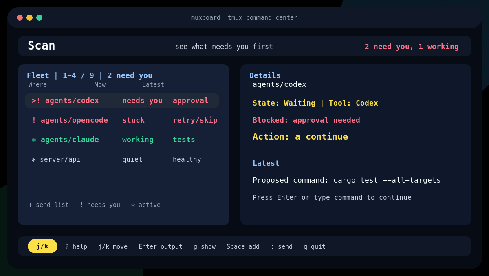

# Private demo guide



The checked-in demo is synthetic. It shows the core loop: scan the fleet, inspect output, continue a waiting agent, review a multi-pane send, and jump back to tmux.

Use this guide when recording a GIF, MP4, asciinema cast, or short launch clip.

The safest path is the built-in synthetic demo. It creates a private tmux server
named `muxboard-demo`, uses generic fake panes, and never touches or records your
live tmux server.

First look:

```bash
just demo-start   # create fake panes
just demo-attach  # explore muxboard
just demo-stop    # tear it down
```

For a non-recording check, run `just demo-smoke`.

## Export media

Render checked-in public visuals and static PNG previews:

```bash
brew install imagemagick
just public-assets  # refresh docs/muxboard-demo.gif and docs/social-preview.png
just demo-assets    # write target/demo/assets/*.png
```

Record and export a GIF or MP4 from a real interactive terminal:

```bash
brew install asciinema agg ffmpeg
just demo-record  # write target/demo/muxboard.cast
just demo-gif
just demo-mp4
just demo-stop
```

## Story

Muxboard is a tmux command center for AI agent fleets. The demo should show one
idea: you can see what needs you and act without hunting through panes.

## What to show

1. Open muxboard with `just demo-attach` or `prefix` + `M`.
2. Show Fleet and Details with at least one waiting agent and one working agent.
3. Press `Enter` to open Output, then `Esc` to return.
4. Press `a` to continue a waiting pane.
5. Press `Space` on two panes, then `:` to start a reviewed multi-pane send.
6. Press `g` to show the selected pane in tmux.
7. Reopen with the dock or drawer preset.

## Capture notes

- Use an 80x24 or 120x36 terminal.
- Prefer the System Colors or Catppuccin Mocha theme.
- Keep pane names generic: `codex`, `claude`, `server`, `tests`.
- Do not include private repo names, local paths, tokens, chat transcripts, or real customer data.
- Keep the final clip under 45 seconds.
- Prefer `.cast` as the source artifact and GIF/WebM/MP4 for sharing.
- Do not commit raw recordings until they have been reviewed.

## One-line positioning

Muxboard is a tmux command center for AI agents, panes, and long-running terminal work.
